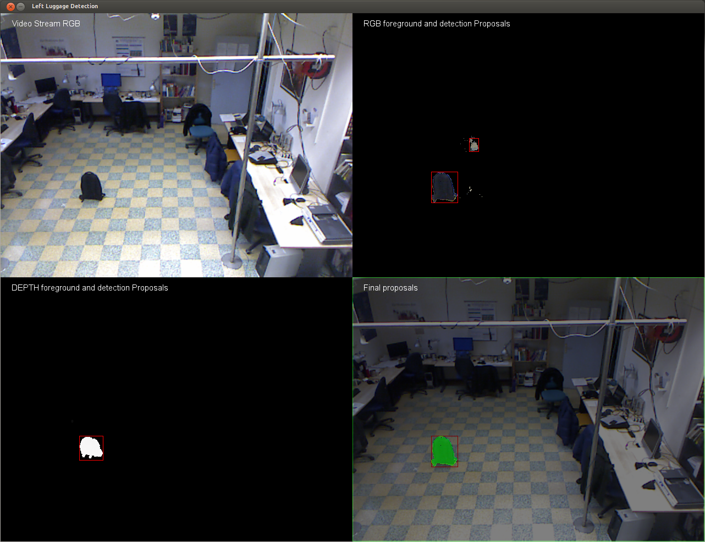

===============
Left luggage detection
===============

**Authors:**
    - *Andrea Rizzo*, andrearizzo[at]outlook.com

    - *Matteo Bruni*, matteo.bruni[at]gmail.com

*Abstract*
------------------
This wiki describes the method used to detect abandoned items in a public space.
Today, video surveillance is used airports, train stations and public spaces where it is essential guarantee a high security level.
The video stream is obtained by a Kinect.....


Introduction
------------------

Approach
------------------
In this section we briefly describe the proposed approach.

*Image data:* we use the Kinect device. Kinect sensor is a horizontal bar connected to a small base with a motorized pivot. The major device features are RGB camera and depth sensor. The device has a USB2 interface and the resolution of the RGB camera is 
:math:`640 \times 480` with 8 bit quantization instead the depth camera resolution is :math:`640 \times 480` with 11 bit quantization.

*Pipeline:* our detection pipeline analyzes the RGB (*intensity*) and depth video streams independently. This means that the RGB left object proposals are found without consider the depth data and the depth proposals are found without consider the RGB data. Both sets of proposal are combined in a later processing stage. The independent processing warranted beacause the RGB video stream is defined everywhere, i.e. for each pixel of a stream frame the intensity value is defined, but as one it is liable to photometric variations. Instead the depth video stream is not defined everywhere. The depth value is only available for the image regions that are close enough to the device. Also for black items the sensor can't measure the depth value.
By using the two video stream a background model for depth and a dual background model for RGB are computed. The spatial changes are accumulated in an aggregator. For the depth aggregator we provide more than one method to accumulate the spatial changes. If the aggregator exceeds a threshold is segmented with a bounding box and we mark the spatial region as left item proposal. The depth and intensity proposal are compared using the overlapping criterion. The bounding boxes that match the selection criteria are considered left objects.

Background modeling
------------------
In this section we describe the methods used to model the background. Then we describe the methods used to accumulate the spatial changes and how the aggregators are processed to extract the proposals.

Depth background model and proposal
`````````````
The depth background model is computed by using the higher-resolution (11-bit) depth matrix because we want to do computations with the depth. The method used to model the background is the accumulate running average. At time :math:`t` the model is updated with the following function:

:math:`model_{t} = (1-alpha) \cdot model_{t-1} + alpha \cdot cdframe_{t}`


Intensity background model and proposal
`````````````


